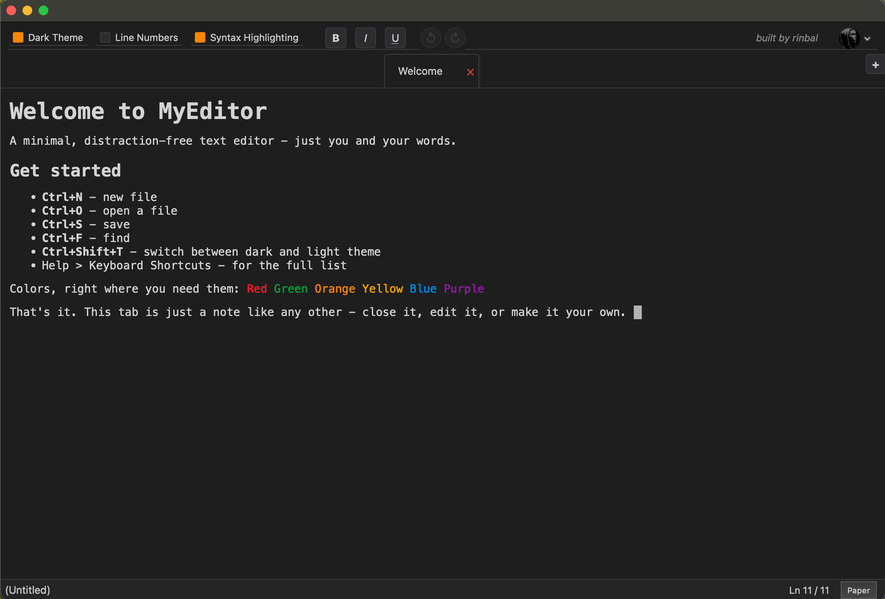

# MyEditor

**A clean, distraction-free desktop text editor. Write locally, publish to Nostr, keep your keys in your own signer.**

<p align="center">
  
</p>

MyEditor is a fast, local-first note editor for lecture notes, quick drafts, and
long-form writing. Write in a calm, focused window, then publish straight to Nostr
as a short note or a full article. Your files stay on your disk and your private
key stays in your signer.

<p align="center">
  <a href="https://github.com/rinbal/my_editor/releases/latest"><b>Download for Windows, macOS, or Linux</b></a>
</p>

---

## Highlights

**Focused writing.** Dark and light themes, tabs, rich text, bullet lists, find,
syntax highlighting, line numbers, and lined / dotted / grid backgrounds with a
paper mode for a real sheet-of-paper feel.

**Publish to Nostr.** Send notes or long-form articles signed on your phone via
NIP-46, keep private encrypted drafts that sync across your devices, manage media
on your own Blossom servers, and mirror any blog in from RSS.
[Read the Nostr guide](docs/nostr.md).

**Stays out of your way.** Crash recovery, session restore, external-change
detection, recent files, drag and drop, and export to `.txt`, `.pdf`, `.md`, and
`.rtf`.

> Developed and tested on Linux. macOS and Windows work but may show minor visual
> differences.

---

## Install

Download the file for your system from the
[latest release](https://github.com/rinbal/my_editor/releases/latest) and open it.

- **Windows:** run the `-windows-setup.exe`. If SmartScreen warns, click
  **More info**, then **Run anyway**.
- **macOS:** open the `.dmg`, drag MyEditor onto **Applications** (follow the
  arrow), then right-click it once and choose **Open**. Use `-arm64` for Apple
  Silicon, `-intel` for older Macs.
- **Linux:** on Ubuntu, Debian, Mint, or Pop!_OS, double-click the `.deb` and
  click **Install**. On any other distribution, use the AppImage:

  ```bash
  chmod +x my-editor-*.AppImage
  ./my-editor-*.AppImage
  ```

The app is unsigned, so the first launch shows a one-time security prompt. The
[full install guide](docs/install.md) walks through every prompt step by step.

---

## Documentation

- [Install guide](docs/install.md) - downloads, security prompts, troubleshooting
- [Nostr publishing, drafts, media, and RSS import](docs/nostr.md)
- [Keyboard shortcuts, menus, and save formats](docs/usage.md)
- [Release process](docs/release-process.md) - for maintainers

---

## Run from source

For development, or on a platform without a prebuilt installer (Python 3.10+):

```bash
git clone https://github.com/rinbal/my_editor.git
cd my_editor
python -m venv .venv
source .venv/bin/activate
pip install -r requirements.txt
python main.py
```

Open a file directly with `python main.py /path/to/file.txt`.

---

*built by rinbal & the Community*

Join the Public [Community Chat](https://nostr-ecosystem.netlify.app/join/g/groups.0xchat.com/my-editor-public-talk?n=My+Editor+-+Public+Talk&a=A+community+for+users%2C+contributors%2C+and+anyone+interested+in+a+clean%2C+distraction-free+note-taking+editor+built+with+Python+and+PySide6.%0A%0AS&p=https%3A%2F%2Fblossom.primal.net%2F6173a8dc06038a1d67d6149755166fb48d74d92d41ef6af8b6cd863489eb3095) to Discuss, Report or provide Feedback or Feature Requests.

