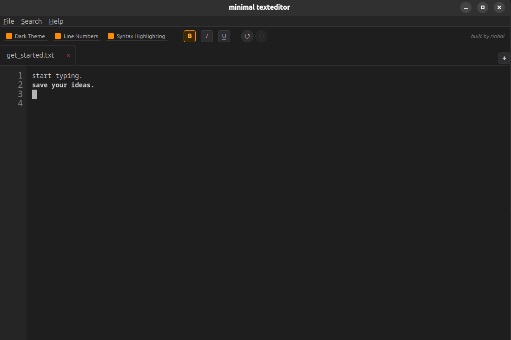

# minimal texteditor

A clean, minimal note-taking text editor built with Python and PySide6.
Designed for writing lecture notes and personal documents with a distraction-free interface.

<p align="center">
  
</p>

---

## Features

- **Dark / Light theme** - toggle anytime, text colors adapt automatically
- **Multiple tabs** - work on several documents at once; drag to reorder
- **Rich text formatting** - bold, italic, underline, text colors
- **Bullet lists** - smart bullet behavior with Tab indentation
- **Find bar** - search with match counter and previous/next navigation
- **Line numbers** - optional gutter on the left
- **Line counter** - current line and total lines always visible in the bottom right corner (`Ln X / Y`)
- **Export formats** - save as `.txt`, `.pdf`, `.md`, `.rtf`
- **Undo / Redo** - full history with header buttons and keyboard shortcuts
- **Syntax highlighting** - automatic language detection by file extension (Python, JavaScript, TypeScript, HTML, CSS, Rust, Go, Java); adapts to dark/light theme; toggleable
- **Recent files** - quick access to the last 10 opened files under `File > Recent Files`
- **Drag and drop** - drag `.txt`, `.md`, `.html` files onto the editor to open them; drag plain text to insert it
- **File change detection** - notifies when an open file is changed externally, with a one-click reload option
- **Crash recovery** - auto-saves every open document in the background; silently restores unsaved work on next launch
- **Session restore** - reopens all previously open files automatically on next launch

---

## Installation

**Requirements:** Python 3.10+

```bash
git clone https://github.com/rinbal/my_editor.git
cd my_editor
python -m venv .venv
source .venv/bin/activate
pip install -r requirements.txt
```

---

## Running

```bash
source .venv/bin/activate
python main.py
```

You can also open a file directly:

```bash
python main.py /path/to/file.txt
```

---

## App Shortcuts

Three launcher templates are included, one per platform:
- `my-editor.desktop.example` — Linux
- `my-editor.app.example/` — macOS
- `my-editor.bat.example` — Windows

### Linux — Desktop Shortcut

The file `my-editor.desktop.example` is a template to register the editor as an application in your Linux desktop environment (GNOME, KDE, etc.).

**1. Find the full path to the project folder:**
```bash
pwd
```
This prints something like `/home/yourname/my_editor` — copy that path.

**2. Copy the template:**
```bash
cp my-editor.desktop.example my-editor.desktop
```

**3. Open `my-editor.desktop` and replace both `/path/to/my_editor` entries with your actual path.**

Example with path `/home/yourname/my_editor`:
```
Exec=/home/yourname/my_editor/.venv/bin/python /home/yourname/my_editor/main.py
Path=/home/yourname/my_editor
```

**4. Install the shortcut:**
```bash
cp my-editor.desktop ~/.local/share/applications/
```

The editor will now appear in your app launcher and can be pinned to the dock.

---

### macOS — App Bundle

The folder `my-editor.app.example/` is a template for a native macOS `.app` bundle. On macOS, any folder named `Something.app` with the right internal structure is treated as a clickable application — no installation tool required.

**Structure of the bundle:**
```
my-editor.app/
└── Contents/
    ├── Info.plist          ← app metadata
    ├── MacOS/
    │   └── my-editor       ← launcher shell script (must be executable)
    └── Resources/          ← optional: place your icon (.icns) here
```

**1. Find the full path to the project folder:**
```bash
pwd
```
This prints something like `/Users/yourname/my_editor` — copy that path.

**2. Copy the template bundle:**
```bash
cp -r my-editor.app.example my-editor.app
```

**3. Open `my-editor.app/Contents/MacOS/my-editor` in a text editor and replace the path:**

Example with path `/Users/yourname/my_editor`:
```bash
cd /Users/yourname/my_editor
.venv/bin/python main.py
```

**4. Make the launcher script executable:**
```bash
chmod +x my-editor.app/Contents/MacOS/my-editor
```

**5. Move the app to Applications (optional but recommended):**
```bash
mv my-editor.app /Applications/
```

You can now double-click `my-editor.app` in Finder to launch the editor, or drag it to the Dock to pin it.

> **Note:** macOS may show a security warning the first time you open the app since it is not from the App Store. To bypass it: right-click the app → **Open** → confirm in the dialog. You only need to do this once.

> **Icon:** By default the app shows a generic icon. To use a custom icon, place a `.icns` file in `my-editor.app/Contents/Resources/` and add the following to `Info.plist` inside the `<dict>` block:
> ```xml
> <key>CFBundleIconFile</key>
> <string>your-icon-name</string>
> ```
> To convert a PNG to `.icns` on macOS, see `iconutil` (built into macOS).

---

### Windows — Batch Script

The file `my-editor.bat.example` is a template for a double-clickable launcher script on Windows.

**1. Find the full path to the project folder:**

Open the project folder in File Explorer, click the address bar, and copy the path. It will look something like `C:\Users\yourname\my_editor`.

**2. Copy the template:**
```
copy my-editor.bat.example my-editor.bat
```

**3. Open `my-editor.bat` in a text editor and replace the path with your actual path.**

Example with path `C:\Users\yourname\my_editor`:
```bat
cd C:\Users\yourname\my_editor
.venv\Scripts\python.exe main.py
```

**4. Double-click `my-editor.bat` to launch the editor.**

**Optional — Pin to taskbar or Start Menu:**
- **Taskbar:** Right-click `my-editor.bat` → **Pin to taskbar**
- **Start Menu:** Place a shortcut to the `.bat` file in:
  ```
  %APPDATA%\Microsoft\Windows\Start Menu\Programs\
  ```

> **Note:** A terminal window will briefly appear on launch — this is normal for `.bat` files on Windows.

> **Icon:** `.bat` files cannot carry a custom icon directly. To use one, create a Windows shortcut (`.lnk`) to the `.bat` file, then right-click the shortcut → **Properties** → **Change Icon** and select any `.ico` file.

---

## Keyboard Shortcuts

### File

| Shortcut | Action |
|---|---|
| `Ctrl+N` | New tab |
| `Ctrl+O` | Open file |
| `Ctrl+S` | Save |
| `Ctrl+Shift+S` | Save As |
| `Ctrl+W` | Close tab |
| `Ctrl+Q` | Quit |

### Formatting

| Shortcut | Action |
|---|---|
| `Ctrl+B` | Bold |
| `Ctrl+I` | Italic |
| `Ctrl+U` | Underline |
| `Ctrl+D` | Reset all formatting |

### Undo / Redo

| Shortcut | Action |
|---|---|
| `Ctrl+Z` | Undo |
| `Ctrl+Y` / `Ctrl+Shift+Z` | Redo |

### Search

| Shortcut | Action |
|---|---|
| `Ctrl+F` | Open find bar |
| `Enter` | Next match (while find bar is open) |
| `Shift+Enter` | Previous match (while find bar is open) |
| `F3` | Find next |
| `Shift+F3` | Find previous |
| `Escape` | Close find bar & return to editor |

### Editor

| Shortcut | Action |
|---|---|
| `Tab` | Indent / create bullet |
| `Shift+Tab` | Outdent / remove bullet indent |
| `Enter` | New line (continues bullet if active) |
| `Enter` (on empty bullet) | Exit bullet mode |
| `Ctrl+Shift+L` | Toggle line numbers |
| `Ctrl+Shift+T` | Toggle dark / light theme |
| `Ctrl+Shift+H` | Toggle syntax highlighting |

---

## Right-Click Menu

Right-clicking in the editor opens a context menu with:

- Copy / Cut / Paste
- **Color** - apply one of six text colors (Red, Green, Orange, Yellow, Blue, Purple)
- **Remove Color** - restore default text color
- Bold / Italic / Underline toggles
- **Reset Format** - clear all formatting at once

Right-clicking a **tab** opens a context menu with:

- **Rename** - rename the file on disk and update the tab (greyed out for unsaved files)
- **Delete File** - move the file to system trash with a confirmation dialog (greyed out for unsaved files)

---

## Save Formats

| Format | Notes |
|---|---|
| `.txt` | Plain text, no formatting |
| `.pdf` | Print-ready, preserves text colors and formatting |
| `.md` | Markdown |
| `.rtf` | Rich Text Format |

---

*built by rinbal*
