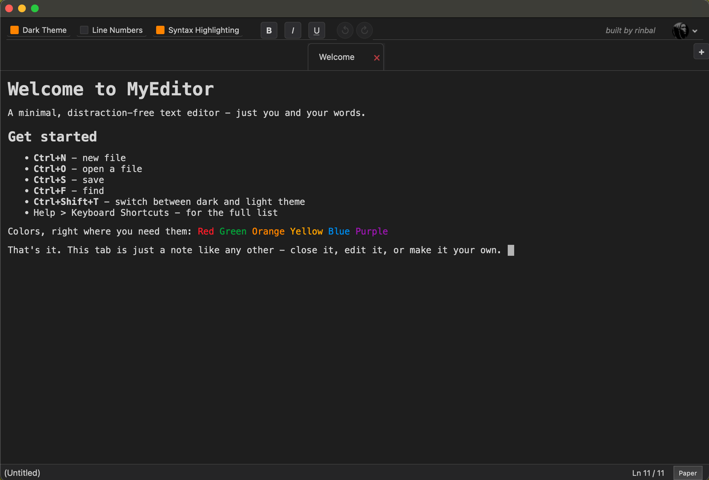

# MyEditor

**A clean, distraction-free desktop text editor. Write locally, publish to Nostr, keep your keys in your own signer.**

<p align="center">
  
</p>

MyEditor is a fast, local-first note editor for lecture notes, quick drafts, and
long-form writing. Write in a calm, focused window, then publish straight to Nostr
as a short note or a full article. Your files stay on your disk and your private
key stays in your signer.

<p align="center">
  <a href="https://github.com/rinbal/my_editor/releases/latest"><b>Download for Windows, macOS, or Linux</b></a>
</p>

---

## Highlights

**Focused writing.** Dark and light themes, tabs, rich text, bullet lists, find,
syntax highlighting, line numbers, and lined / dotted / grid backgrounds with a
paper mode for a real sheet-of-paper feel.

**Publish to Nostr.** Send notes or long-form articles signed on your phone via
NIP-46, keep private encrypted drafts that sync across your devices, and manage
media on your own Blossom servers.
[Read the Nostr guide](docs/nostr.md).

**Import from anywhere.** Pull content in as private drafts from RSS / Atom /
JSON feeds, Nostr profiles and events, NostrHub NIPs, Bluesky threads, Markdown
files and GitHub folders, sitemaps, WordPress and Ghost exports, Medium and
Substack ZIPs, and podcast feeds (with chapters). Preview and pick items before
anything is signed, recover full text for teaser-only feeds, mirror images to
your Blossom server, and subscribe to sources (synced privately via your
relays) to import "new since last visit" later. OPML lists bulk-subscribe.

**Reads PDFs, too.** A built-in distraction-free PDF viewer: open any PDF in a
tab, find text, select and copy passages straight into your notes, follow links,
zoom or fit to width, browse the table of contents, and pick up on the exact
page you left off. Keyboard-first navigation (j/k, n/p, g, Space) follows the
muscle memory of readers like SumatraPDF, and regenerated PDFs (LaTeX builds,
re-exports) refresh in place.

**Stays out of your way.** Crash recovery, session restore, external-change
detection, recent files, drag and drop, and export to `.txt`, `.html`, `.pdf`,
`.md`, `.rtf`, and `.Rmd`. HTML and PDF exports are self-contained (images
embedded, metadata, page numbers, Page Setup dialog).

**R Markdown.** Open and edit `.Rmd` files as source, convert rich documents to
R Markdown, and knit to HTML or PDF; missing toolchain parts (R, pandoc,
rmarkdown, TinyTeX) install on demand from their official sources.

> Developed and tested on Linux. macOS and Windows work but may show minor visual
> differences.

---

## Install

Download the file for your system from the
[latest release](https://github.com/rinbal/my_editor/releases/latest) and open it.

- **Windows:** run the `-windows-setup.exe`. If SmartScreen warns, click
  **More info**, then **Run anyway**.
- **macOS:** open the `.dmg`, drag MyEditor onto **Applications** (follow the
  arrow), then right-click it once and choose **Open**. Use `-arm64` for Apple
  Silicon, `-intel` for older Macs.
- **Linux:** on Ubuntu, Debian, Mint, or Pop!_OS, double-click the `.deb` and
  click **Install**. On any other distribution, use the AppImage:

  ```bash
  chmod +x my-editor-*.AppImage
  ./my-editor-*.AppImage
  ```

The app is unsigned, so the first launch shows a one-time security prompt. The
[full install guide](docs/install.md) walks through every prompt step by step.

---

## Documentation

- [Install guide](docs/install.md) - downloads, security prompts, troubleshooting
- [Nostr publishing, drafts, media, and RSS import](docs/nostr.md)
- [Keyboard shortcuts, menus, and save formats](docs/usage.md)
- [Release process](docs/release-process.md) - for maintainers

---

## Run from source

For development, or on a platform without a prebuilt installer (Python 3.10+):

```bash
git clone https://github.com/rinbal/my_editor.git
cd my_editor
python -m venv .venv
source .venv/bin/activate
pip install -r requirements.txt
python main.py
```

Open a file directly with `python main.py /path/to/file.txt`.

---

## License

MyEditor is free software, licensed under the [GNU Affero General Public License v3.0 or later](LICENSE).

Copyright (C) 2026 rinbal.

This program is distributed in the hope that it will be useful, but WITHOUT ANY WARRANTY; without even the implied warranty of MERCHANTABILITY or FITNESS FOR A PARTICULAR PURPOSE. You should have received a copy of the license along with this program; if not, see <https://www.gnu.org/licenses/>.

---

*built by rinbal & the Community*

Join the Public [Community Chat](https://nostr-ecosystem.netlify.app/join/g/groups.0xchat.com/my-editor-public-talk?n=My+Editor+-+Public+Talk&a=A+community+for+users%2C+contributors%2C+and+anyone+interested+in+a+clean%2C+distraction-free+note-taking+editor+built+with+Python+and+PySide6.%0A%0AS&p=https%3A%2F%2Fblossom.primal.net%2F6173a8dc06038a1d67d6149755166fb48d74d92d41ef6af8b6cd863489eb3095) to Discuss, Report or provide Feedback or Feature Requests.

